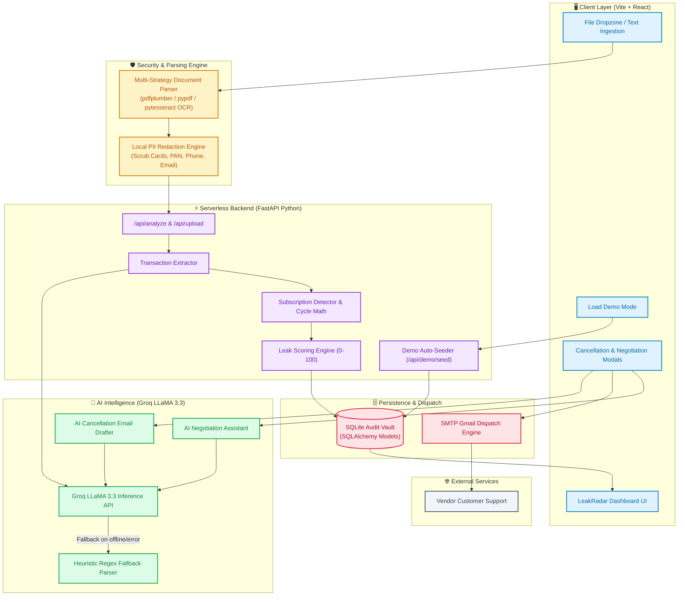
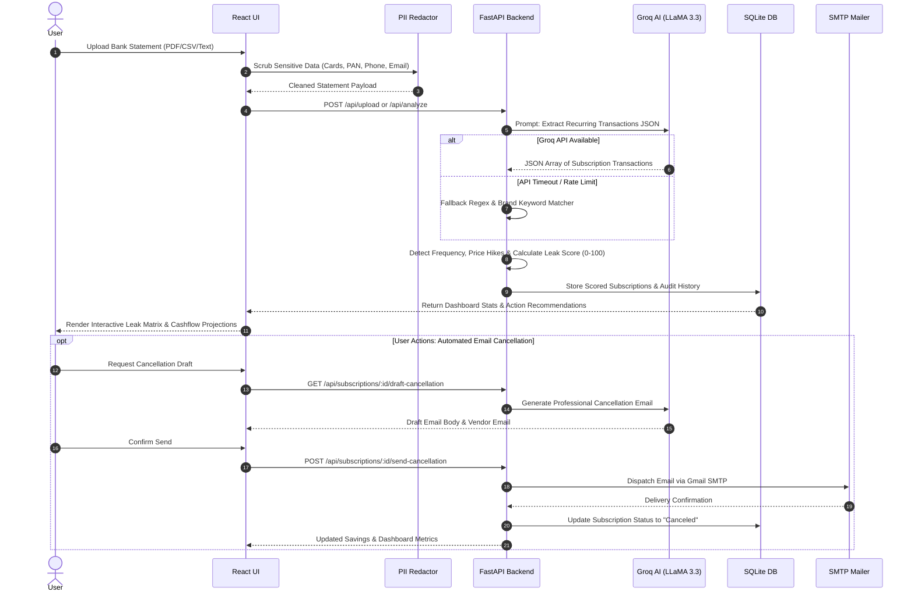

# 📐 LeakRadar System Architecture & Data Flow

This document details the high-level architecture, module dependencies, data processing pipeline, and deployment setup for **LeakRadar**.

---

## 🏗️ High-Level System Architecture Diagram

---

## 🔄 End-to-End Execution Flow

---

## 🧩 Architectural Components Breakdown

### 1. **Client Layer (`frontend/`)**
- Built with **Vite + React 18**, **TailwindCSS**, and **Framer Motion**.
- State is managed via lightweight state hooks with responsive views:
  - **Landing View**: Hero, Feature Breakdown, Instant Demo Launcher.
  - **Dashboard View**: Financial Leak Overview, Savings Counter, Category Distribution, Cashflow Shock Projections, and Interactive Action Matrix.
  - **Modals**: Upload Modal, Cancellation Email Modal, AI Negotiation Chat Modal, and Downgrade Options Modal.

### 2. **Security & Ingestion Layer (`backend/utils.py` & `backend/main.py`)**
- **Multi-Strategy File Parsing**: Supports native PDF text extraction (`pdfplumber` layout-aware parsing + `pypdf` + `pdfminer`) and scanned image OCR (`pytesseract`).
- **Client-Side PII Scrubbing**: Redacts sensitive financial indicators before LLM processing:
  - 13–16 digit credit/debit card numbers
  - PAN cards (Indian tax identification)
  - Account & phone numbers
  - Non-whitelisted personal email addresses

### 3. **AI Intelligence Engine (`backend/extract.py` & `backend/score.py`)**
- **Groq LLaMA 3.3 Instant Model**: Converts unstructured financial text into structured JSON transaction objects.
- **Fail-safe Fallback Parser**: Heuristic regex engine that parses transaction lines if external API limits are exceeded.
- **Deterministic Leak Scoring Algorithm**:
  $$\text{Leak Score} = \text{Base} + \text{Price Hike Penalty} + \text{Duplicate Category Penalty} + \text{Unused Penalty}$$
  Ranging from 0 (Sealed Leak) to 100 (Critical Financial Waste).

### 4. **Persistence & Action Execution (`backend/database.py` & `models.py`)**
- **SQLite Database**: Lightweight persistent relational store mapped using SQLAlchemy ORM.
- **SMTP Email Dispatcher**: Automated SMTP integration for direct delivery of cancellation notices to vendors.

---

## ☁️ Serverless Deployment Architecture (Vercel)

- **Frontend Build**: Static SPA bundle deployed to Vercel CDN.
- **Backend API**: Python FastAPI application mounted via Vercel Serverless Functions (`backend/test_vercel.py` using `@vercel/python`).
- **Rewrite Rules** in `vercel.json` route `/api/*` requests directly to the FastAPI serverless instance.
